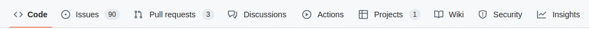

# 👷‍♀️ Contribuciones

> _Las contribuciones son siempre bienvenidas._

Si deseas mejorar este proyecto o agregar nuevas funcionalidades, no dudés en abrir un **Issue** o enviar un **Pull Request**. Podés encontrar estas opciones en la esquina superior izquierda, justo debajo del nombre del repositorio.

- **💡 Issue**: Si queres reportar un error, sugerir una mejora o discutir una idea. Usalo para iniciar una conversación sobre cambios en el proyecto.

- **🔄 Pull Request**: Si realizaste cambios específicos en el código y queres compartirlo andá por ahi. Permite revisar, discutir y, si es aprobado, integrar esos cambios al proyecto.

- **💬 Discussions**: Algunos repositorios tienen habilitada la opción de "Discussions" para debates más amplios o temas no necesariamente ligados a errores o mejoras directas. Si tenés alguna sugerencia general o querés discutir temas con la comunidad, podés usar esta sección.

- **🗂 Projects**: En algunos repositorios también vas a encontrar habilitada la pestaña "Projects", donde organizamos y damos seguimiento a las tareas y objetivos del proyecto. Podés usarla para ver el estado actual del trabajo o para sugerir nuevos proyectos.

> Tené en cuenta que tenemos un [Código de conducta](CODE_OF_CONDUCT.md) y que toda actividad en la organización [@DemocraciaEnRed](https://github.com/DemocraciaEnRed) se rige por él. Leelo antes de contribuir, ya que ser parte de esta comunidad significa que acepta cumplirlo. Gracias.
